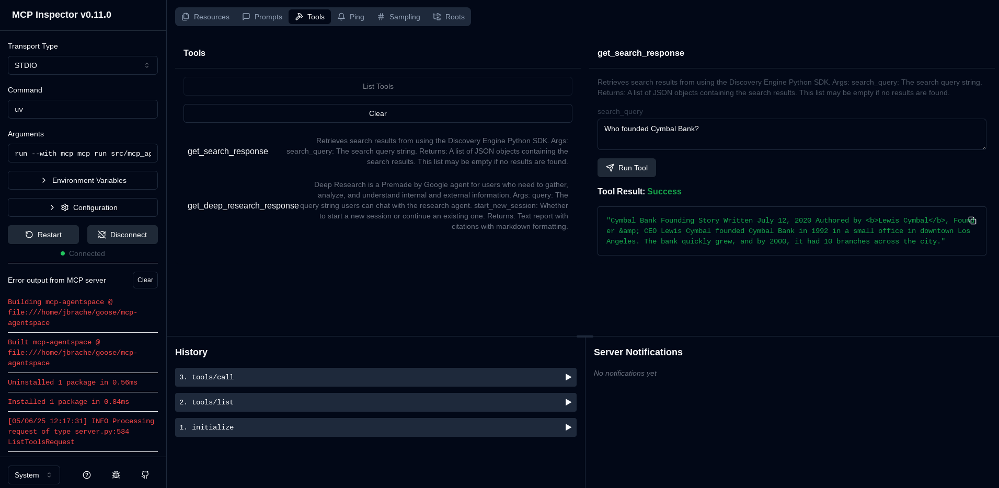
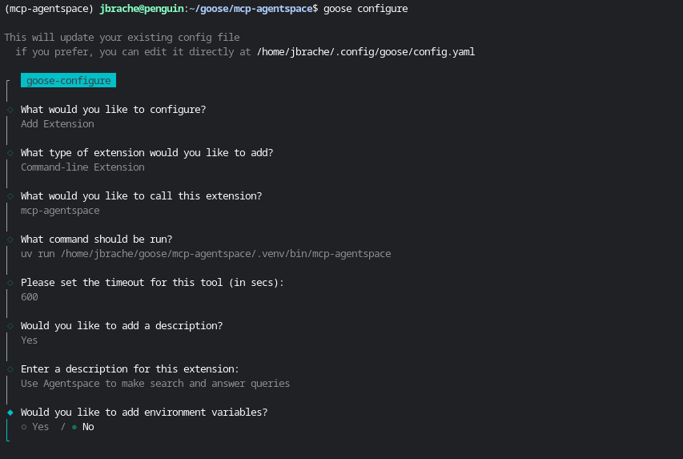
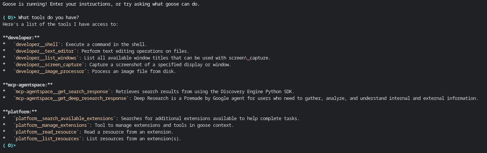
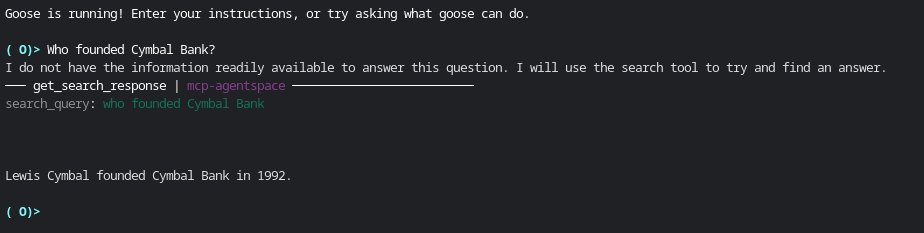

# Building Custom Agentspace Extensions with Goose


[Goose](https://block.github.io/goose/docs/quickstart) allows you to extend its functionality by creating your own [custom extensions](https://block.github.io/goose/docs/tutorials/custom-extensions/), which are built as MCP servers. These extensions are compatible with Goose because it adheres to the [Model Context Protocol (MCP)][mcp-docs]. MCP is an open protocol that standardizes how applications provide context to LLMs. It enables a consistent way to connect LLMs to various data sources and tools, making it ideal for extending functionality in a structured and interoperable way. 

In this guide, we build an MCP server using the [Python SDK for MCP][mcp-python]. We’ll demonstrate how to create an MCP server that leverages [Google Cloud Agentspace](https://cloud.google.com/agentspace/agentspace-enterprise/docs/overview) for search and assistance, integrate it as an extension in Goose.

You can checkout other examples in this [MCP servers repository][mcp-servers]. MCP SDKs are also available in [Typescript][mcp-typescript] and [Kotlin][mcp-kotlin].

---

## Prerequisites
This guide sets up a basic Agentspace instance with a dataset, make sure you have followed the steps here to configure your Agentspace demo instance: [Get started with Agentspace Enterprise](https://cloud.google.com/agentspace/agentspace-enterprise/docs/quickstart-agentspace)

You can also test your Agentspace instance with this sample to make sure it's setup properly: [intro_agentspace.ipynb](https://github.com/GoogleCloudPlatform/generative-ai/blob/main/search/agentspace/intro_agentspace.ipynb)

## Step 1: Initialize Your Project

The first step is to create a new project using [uv][uv-docs]. We will name our project `mcp-agentspace`.

Run the following commands in your terminal to set up a basic structure for your MCP server:

```bash
uv init mcp-agentspace

cd mcp-agentspace
rm main.py

mkdir -p src/mcp_agentspace
touch src/mcp_agentspace/server.py  # Your MCP server code (tool, resources, prompts)
touch src/mcp_agentspace/__init__.py  # Primary CLI entry point
touch src/mcp_agentspace/__main__.py # To enable running as a Python module
```

Your project directory structure should look like this:

```plaintext
.
├── README.md
├── pyproject.toml
├── src
│   └── mcp_agentspace
│       ├── __init__.py
│       ├── __main__.py
│       └── server.py
└── uv.lock
```

---

## Step 2: Write Your MCP Server Code

In this step, we’ll implement the core functionality of the MCP server. Here is a breakdown of the key components:

1. **`server.py`**: This file holds the main MCP server code. In this example, we define a single tool to read Wikipedia articles. You can add your own custom tools, resources, and prompts here.
2. **`__init__.py`**: This is the primary CLI entry point for your MCP server.
3. **`__main__.py`**: This file allows your MCP server to be executed as a Python module.

Below is the example implementation for the Wikipedia MCP server:

### `server.py`

See [src/mcp_agentspace/server.py](mcp-agentspace/src/mcp_agentspace/server.py) ]

### `__init__.py`

```python
import argparse
from .server import mcp

def main():
    """MCP Agentspace: Use Agentspace to access the search engine and make search and answer queries."""
    parser = argparse.ArgumentParser(
        description="Gives you the ability to search your internal data sources."
    )
    parser.parse_args()
    mcp.run()

if __name__ == "__main__":
    main()
```

### `__main__.py`

```python
from mcp_agentspace import main

main()
```

---

## Step 3: Define Project Configuration

Configure your project using `pyproject.toml`. This configuration defines the CLI script so that the mcp-agentspace command is available as a binary. Below is an example configuration:

```toml
[project]
name = "mcp-agentspace"
version = "0.1.0"
description = "MCP Server for Agentspace"
readme = "README.md"
requires-python = ">=3.11"
dependencies = [
    "mcp[cli]>=1.2.0",
    "requests>=2.32.3",
    "google-cloud-discoveryengine>=0.13.8",
]

[project.scripts]
mcp-agentspace = "mcp_agentspace:main"

[build-system]
requires = ["hatchling"]
build-backend = "hatchling.build"
```
---

## Step 4: Test Your MCP Server

### Using MCP Inspector

1. Setup the project environment:

   ```bash
   uv sync
   ```

2. Activate your virtual environment:

   ```bash
   source .venv/bin/activate
   ```

3. Run your server in development mode:

   ```bash
   mcp dev src/mcp_agentspace/server.py
   ```

4. Go to `http://localhost:5173` in your browser to open the MCP Inspector UI.

5. In the UI, you can click "Connect" to initialize your MCP server. Then click on "Tools" tab > "List Tools" and you should see the `get_search_response` tool. 
   Then you can try to call the `get_search_response` tool with Query set to "Who founded Cymbal Bank?" and click "Run Tool". 



### Testing the CLI

1. Install your project locally:

   ```bash
   uv pip install .
   ```

2. Check the executable in your virtual environment:

   ```bash
   ls .venv/bin/  # Verify your CLI is available
   ```

3. Test the CLI:

   ```bash
   mcp-agentspace --help
   ```

   You should see output similar to:

   ```plaintext
   ❯ mcp-agentspace --help
   usage: mcp-agentspace [-h]

   Gives you the ability to read Wikipedia articles and convert them to Markdown.

   options:
     -h, --help  show this help message and exit
   ```

---

## Step 5: Integrate with Goose

To add your MCP server as an extension in Goose:

1. Go to `Settings > Extensions > Add`.
2. Set the `Type` to `StandardIO`.
3. Provide the ID, name, and description for your extension.
4. In the `Command` field, provide the absolute path to your executable. For example:
   ```plaintext
   uv run /full/path/to/mcp-agentspace/.venv/bin/mcp-agentspace
   ```

Alternatively in Step 3, you can also publish your package to pypi. Once published, the server can be run directly using uvx. For example:

```
uvx mcp-agentspace
```

For the purposes on this guide, we will show you how to run the local version. 



---

## Step 6: Use Your Extension in Goose

Once integrated, you can start using your extension in Goose. Open the Goose chat interface and call your tool as needed.

You can verify that Goose has picked up the tools from your custom extension by asking it "what tools do you have?"



Then, you can try asking questions that require using the extension you added.



🎉 **Congratulations!** You’ve successfully built and integrated a custom MCP server with Goose.


[mcp-docs]: https://modelcontextprotocol.io/
[mcp-python]: https://github.com/modelcontextprotocol/python-sdk
[mcp-typescript]: https://github.com/modelcontextprotocol/typescript-sdk
[mcp-kotlin]: https://github.com/modelcontextprotocol/kotlin-sdk
[mcp-servers]: https://github.com/modelcontextprotocol/servers
[uv-docs]: https://docs.astral.sh/uv/getting-started/